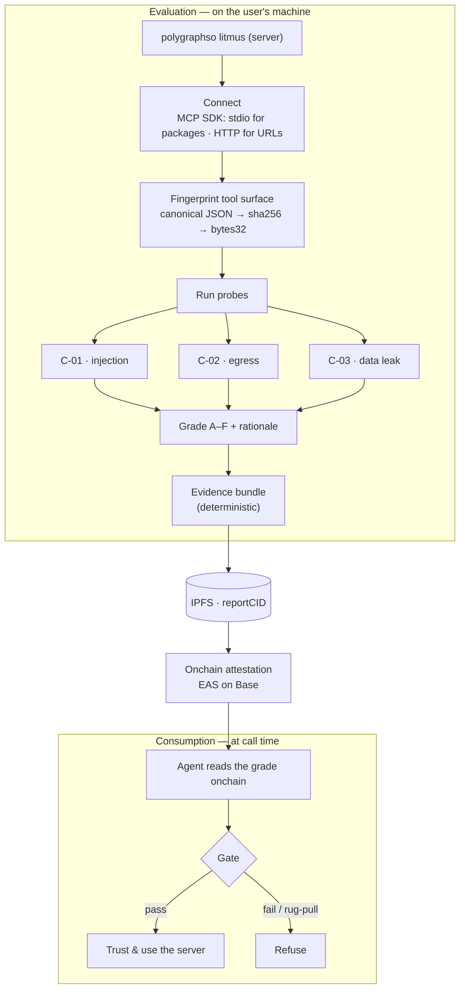
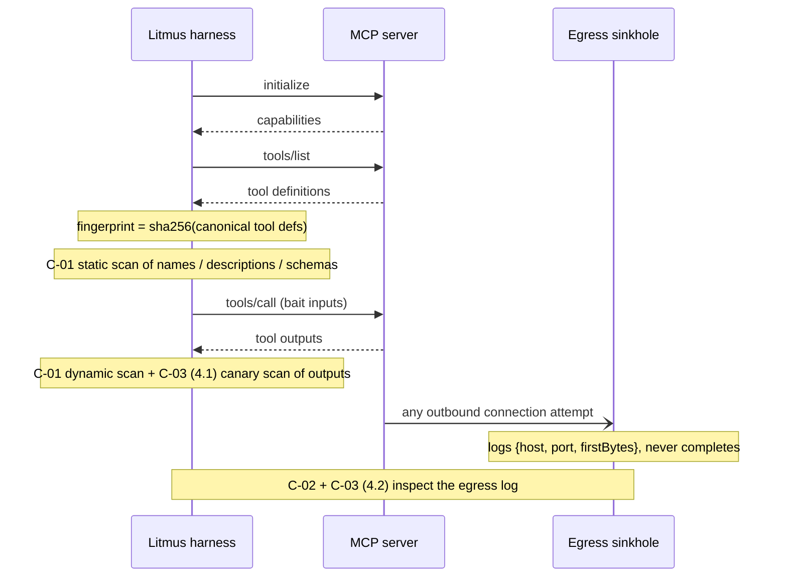
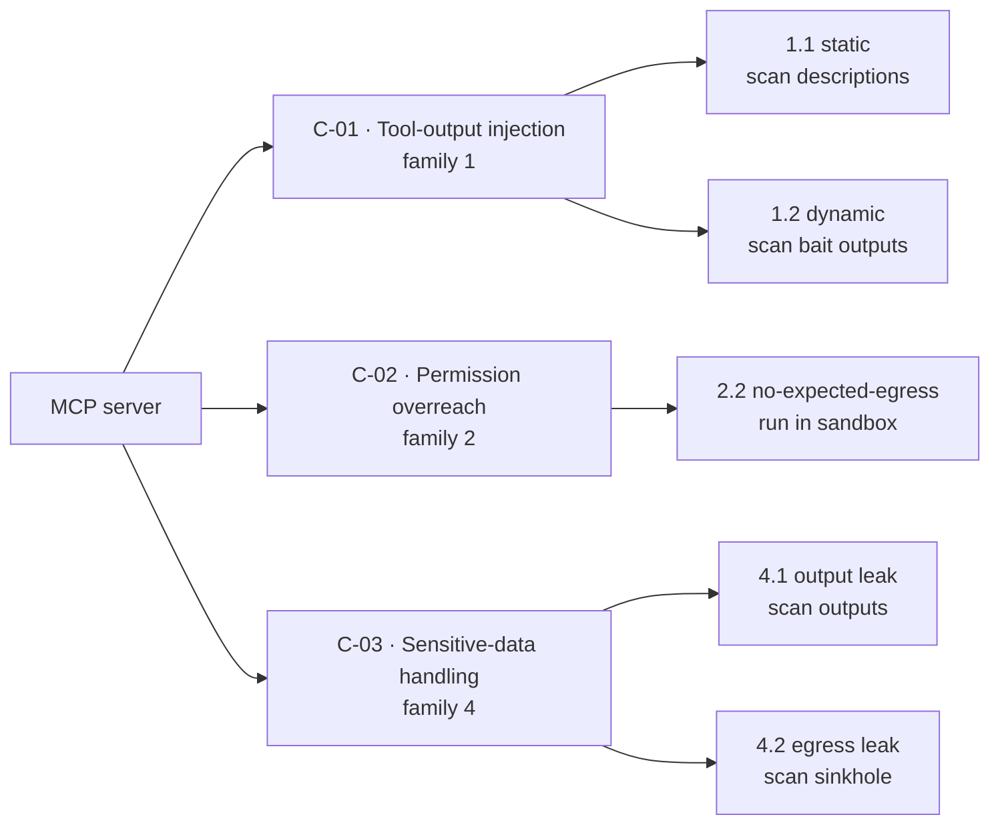
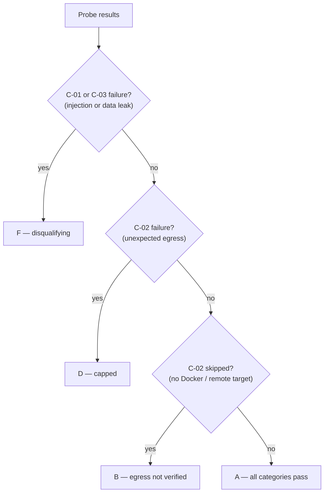
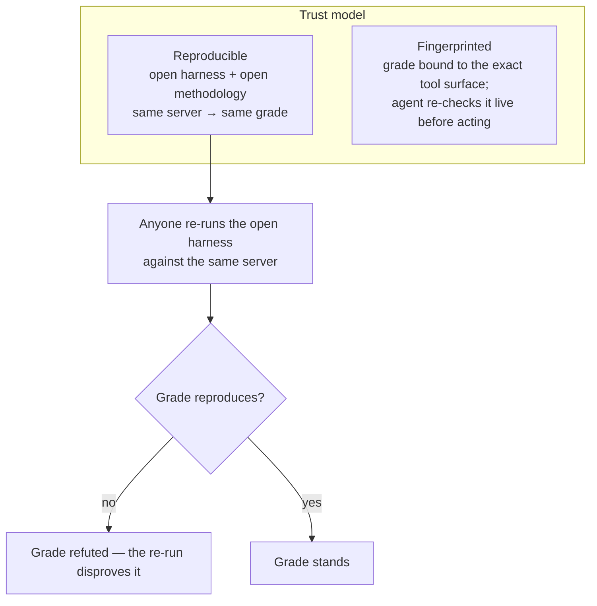
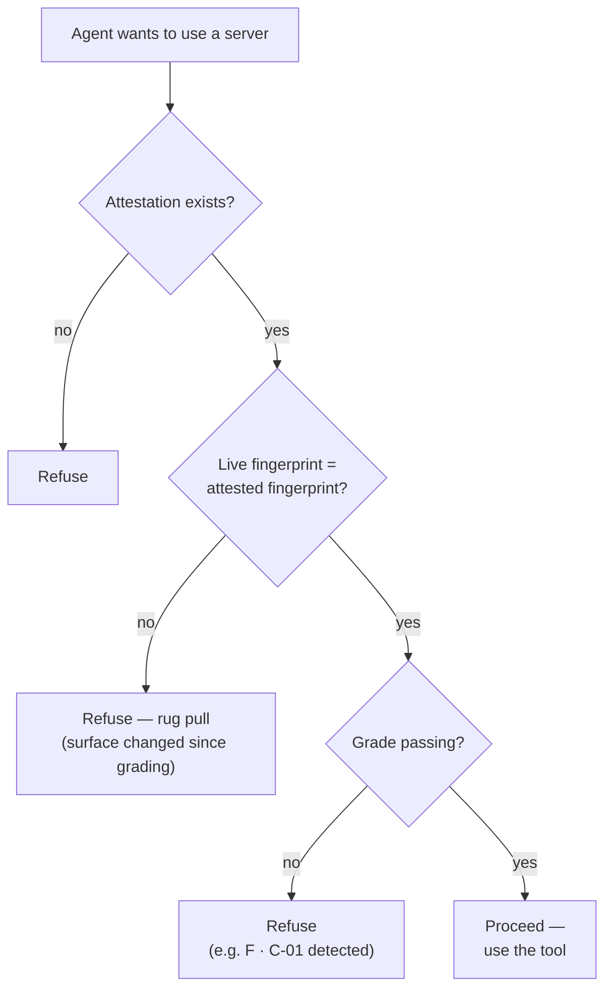

# How the litmus test works

A visual companion to [`litmus-test-v1.md`](./litmus-test-v1.md) (the methodology) and [`technical-design.md`](./technical-design.md) (the harness internals). Diagrams render natively on GitHub.

Agents increasingly call MCP-server tools they didn't write and can't see — and hand them money, secrets, and write access. The litmus test is a **black-box behavioral probe** of one such tool: a harness connects to an MCP server *exactly the way an AI agent would*, drives its tools, and watches two things: what the server **says back** (its outputs) and what it **reaches for** (its network). The server stays passive — it integrates nothing and never knows it is being tested.

---

## 1. End-to-end flow

Three zones: evaluation runs on the user's own machine, the proof lives onchain, and consumption happens at the agent's call time.

Four properties hold throughout: the **heavy compute runs on the user's machine**, the **grade is read from chain** (not a central DB), **every result is reproducible** from the published bundle, and a **false grade is falsifiable** — anyone can re-run the open harness and disprove it (§5).

---

## 2. How the harness talks to the MCP server

The harness is a plain MCP **client**. It launches a local package over **stdio** (or reaches a remote URL over **Streamable HTTP**), runs the normal handshake, and then probes.

**The fingerprint** is what binds a grade to an exact tool surface. From `tools/list` it keeps `{name, description, inputSchema}` per tool, sorts tools and keys, normalizes whitespace **but keeps raw Unicode** (so a hidden-character attack still changes the hash), then `JSON.stringify → sha256 →` a `bytes32`. Change a tool description later and the hash no longer matches — that is how rug pulls are caught (§4).

---

## 3. The probes — 3 categories, 5 probes

| Code | Question it answers | Mechanism | Fails when |
|---|---|---|---|
| **C-01** Injection | Does it try to hijack the agent? | Static scan of names/descriptions/schemas (1.1) + dynamic scan of bait-call outputs (1.2) | Any high-severity hit: instruction-mimicry, invisible Unicode, markdown/link tricks |
| **C-02** Egress | Does it phone home? | Server runs in a hardened **default-deny Docker** container; egress routed to a local **sinkhole** that logs `{host, port, firstBytes}` and never completes | Any outbound attempt during a no-egress run |
| **C-03** Data leak | Does your data come back out? | Plant **canaries** (`POLYGRAPH-CANARY-<uuid>`, PII, bearer token) into args/workdir/env, then scan outputs (4.1) and the sinkhole (4.2) | A canary surfaces where it shouldn't |

> A fourth category — **C-04 adversarial-input handling** (family 3) — is specced but **deferred to v2**.

**Shared scanners** (`scanners.ts`, pure functions over text): `invisibleUnicode` · `instructionMimicry` · `markdownTricks` · `canaryMatch`. Each returns `{kind, severity, match, offset}`; probes decide pass/fail from severity.

**Graceful degradation:** C-01 and probe 4.1 are pure response-inspection and run anywhere. C-02 and probe 4.2 need the Docker sandbox; without it they are recorded as `skipped` / `partial` with a reason — never silently dropped.

---

## 4. Grading

A single letter **A–F**, always with a rationale string.

Injection and data-leak directly harm an agent that trusts the server, so they floor the grade at **F**. Unexpected egress is serious but not proven exfiltration, so it caps at **D**. The **B** tier keeps the no-Docker path usable while stating plainly that egress was not checked. Category encoding for the attestation: `0 = pass`, `1 = fail`, `2 = skipped`.

---

## 5. What makes a self-grade trustworthy

v1 is self-run and self-minted, so trust rests on two properties the methodology can't be without. (The hosted service adds an operator-run, operator-minted mode — polygraph runs and signs instead of the subject; the same two properties still carry the trust, with the operator in the minter's seat. See [`hosted-service.md`](./hosted-service.md).)

- **Reproducible** makes a false grade *falsifiable* — anyone re-runs `litmus-v1` against the same server and the lie collapses.
- **Fingerprinted** closes the bait-and-switch: pass clean, then serve something malicious → the live fingerprint no longer matches → the agent refuses.

### Can't I just fake it?

Plain self-mint **is** forgeable — you run and sign it yourself, so you could patch the harness, hand-write a clean bundle, and mint a passing attestation. v1 doesn't pretend otherwise; reproducibility makes a fake grade **falsifiable**, not impossible:

| Layer | Makes forgery… | Covers | The catch |
|---|---|---|---|
| **Reproducibility only** — v1 | *falsifiable* — anyone re-runs and disproves it | all probes | no consequence; nobody is obliged to re-run |
| **USDC challenge bond** (roadmap) | *unprofitable* — stake slashed on a disproven re-run | all probes | economic, not cryptographic; scales with bond size + challengers |
| **zkTLS / web-proofs** | *impossible* (responses) | C-01 / C-03 output, remote HTTP only | can't witness egress; no stdio |
| **TEE / enclave attestation** | *impossible* — hardware signs the run | all probes | needs TEE hardware; trust shifts to the chip vendor |
| **Independent re-run** (lab model) | *impossible* — subject doesn't run the trust-critical pass | all probes | reintroduces the compute cost self-run avoids |

**Why a fabricated grade doesn't survive:** the attestation pins the `toolDefsFingerprint` (the exact surface graded) and the `reportCID` (the full evidence bundle, content-addressed on IPFS). The trust-critical checks run against the **live server** and are read **on-chain** — never from polygraph's database — so anyone can fetch your evidence, re-run the open harness against your server, and compare. A fake "A" simply doesn't reproduce.

**What reproducibility doesn't buy is *consequence*.** Nothing obliges a skeptic to re-run, and a disproven lie costs the minter nothing on its own. The layers that add that consequence — a staked **USDC challenge bond** — and that make forgery outright *impossible* — **zkTLS** (remote responses), **TEE** proof-of-execution, an **independent re-run** — are the roadmap, not v1 ([`onchain-proof-spec.md`](./onchain-proof-spec.md) §9). v1 deliberately ships the cheapest honest layer: *falsifiability plus rug-pull resistance*.

### The other problem: evasion

Forgery is a *fake* grade; evasion is a *genuine* one the server games. Because the methodology is open, a server can recognize the test context and behave during evaluation, then misbehave in production (a "defeat device"). No proof layer fixes this; it is mitigated by randomized canaries, expiring grades, continuous re-checks, and the live-fingerprint gate — not eliminated.

---

## 6. The agent-gate (consumption side)

Before an agent trusts a server, it checks the grade cheapest-first.

The live-fingerprint comparison (step 2) is **mandatory**, not optional: without it, a passing attestation could front for a tool surface the server no longer serves.

---

## Build status

This describes `litmus-v1` as specified. The behavioral harness is built and ships open-source as the npm package **`@polygraphso/litmus`** — run it with `npx @polygraphso/litmus litmus <server>`, or let an agent call its `run_litmus` MCP tool (see the repo [`README.md`](./README.md) → *Use it*). The onchain and web layers are built and wired, and the operator-run **hosted service** (the `publish-litmus` command — containerized/in-process harness, best-effort headless mint, one `hosted_runs` row — [`hosted-service.md`](./hosted-service.md)) is built; both pend external services (keys, wallets, deploys, the runner VM) in [`plans/external-needs.md`](../plans/external-needs.md). Today's *public* grades on polygraph.so are still metadata-only *adoption* scoring (in `core/packages/scoring`); behavioral grades publish as attestations once minting goes live. Package layout and build sequence: [`technical-design.md`](./technical-design.md).
